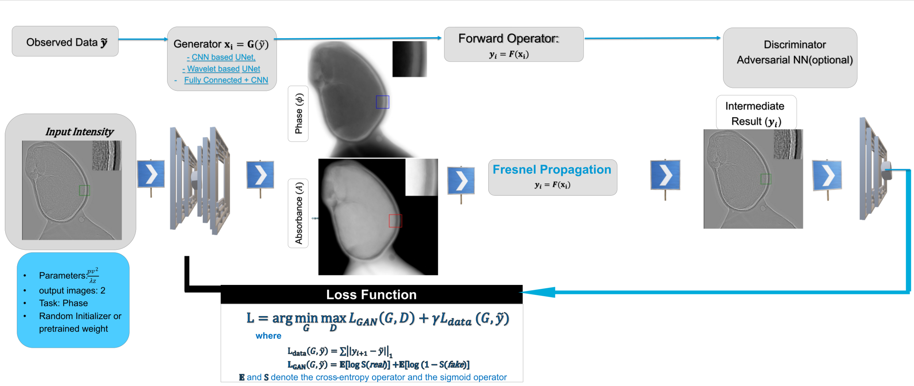

# SelfPhish
## Self-supervised physics-informed generative networks for phase retrieval from a single X-ray hologram


## 📦 Installation & Setup

1. **Clone the repo**  
   ```bash
   git clone https://github.com/daveabiy/SelfPhish.git
   cd SelfPhish
   ```

2. **Create a Python environment**  
   (Example with Conda)  
   ```bash
   conda create -n selfphish python=3.12
   conda activate selfphish
   ```

3. **Install dependencies**  
   ```bash
   pip install -r requirements.txt
   ```
   Required packages include:
   - PyTorch ≥1.12  
   - torchvision  
   - scikit-image  
   - numpy  

4. **GPU / CUDA**  
   By default the code uses `cuda:0` if available; you can override via the `device` parameter in your experiment.

---

## 🚀 Running an Experiment

1. **Import & pick your experiment**  
   ```python
   from libraries.available_experiments import *
   ```

2. **Use the built-in “spider_hair_best” example**  
   ```python
   spider = experiments.spider_hair_best(
       idx=[120],                  # which frames to load (single int or list)
       abs_ratio=5e-4,             # any override defaults go here
       dis_depth=2,
       dis_type='unet',            # chose discriminator architecture {cnn, unet}
       model_type='wavelet',       # chose generator architecture. {CNN based Unet, Wavelet based Unet, FC}
       device='cuda:0'
   )

   # spider['path'] is already a list of numpy arrays loaded from data_spider.tif
   print(f"Loaded {len(spider['path'])} image(s), each shape = {spider['path'][0].shape}")

   model = make_ganrec_model(**spider)

   # Launch training
   model.train(iter_num=1000)
   ```

3. **What’s in `spider_hair_best`**  
   ```python
   def spider_hair_best(self, idx=[120], setup_info=setup_info, **kwargs):
       image_path = 'data/ganrec/data_spider.tif'
       idx = [idx] if isinstance(idx, int) else idx
       images = io.imread(image_path)
       images = [images[i] for i in idx] if len(idx) > 1 else [images[idx[0]]]

       spider_hair_best = {
           'path': images,
           'experiment_name': 'spider_hair_best',
           'energy_kev': 11.3,
           'pv': 1.047e-7,
           'z': 7.888e-2,
           'fresnel_number': 0.00125846,
           'abs_ratio': 0.00686655,
       }
       return {**setup_info, **spider_hair_best, **kwargs}
   ```

---

## 🔧 Adding Your Own Experiment

1. Open `libraries/available_experiments.py`.  
2. Define a new function, following the pattern above:
   ```python
   def my_new_exp(self, setup_info=setup_info, **kwargs):
       params = {
           'path': io.imread('data/my_images.tif'),
           'experiment_name': 'my_new_exp',
           'energy_kev': 12.0,
           'pv': 2e-7,
           'z': 0.05,
           'fresnel_number': compute_fresnel(...),
           'abs_ratio': 1e-3,
       }
       return {**setup_info, **params, **kwargs}
   ```
3. In your script:
   ```python
   spider = experiments.my_new_exp(dis_type='patchgan', device='cuda:0')
   model = make_ganrec_model(**spider)
   model.train(iter_num=500)

   ```
4. Try the scrip by running:
   ```python
   python qr.py
   ```
Enjoy experimenting with SelfPhish! 🚀  